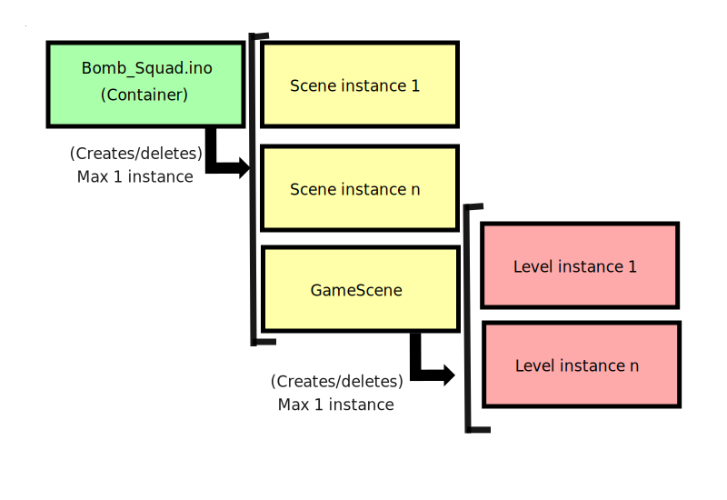
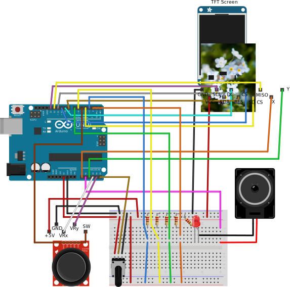

# Dokumentasjon
Videodemonstrasjon av løsningen kan sees her: https://youtu.be/AQeiSyJKehU

Jeg hadde ikke stativ tilgjengelig, så det ble litt vinglete, men jeg tror det viser greit en del av spillet. Jeg måtte klippe det sammen litt, fordi det var ekstremt vanskelig å gjennomføre spillet mens jeg filmet. I tillegg ble jeg frustrert av å ikke klare minispillene.

## Mappestsruktur
Jeg har forsøkt å ha en ryddig struktur på hele prosjektet, men det har raknet litt mot slutten. Jeg synes dette spesielt på grunn av at man ikke har mulighet for å lage undermapper i prosjektet, og på denne måten ligger alle prosjektfilene i samme mappe. Jeg har forsøkt å gi alle filene her beskrivende navn, slik at det er mulig å finne frem.

All kildekoden ligger i mappen `src/Bomb_Squad`, og all grafikk som kreves ligger i mappen `res`. I mappen `docs` ligger koblingsskjemaet og en oversikt over flyten i programmet.

## Forutsetninger
Det er en del forutsetninger som ligger til grunn for at løsningen skal kunne kjøres. For det første må alle filene i mappen `res` legges over på roten av et minnekort som støttes av Arduino's SD-bibliotek, og settes i skjermen, slik at grafikk kan bli lastet inn i programmet.

I og med at progammet så og si tar hele programminnet på Arduinoen, er det ikke sikkert det vil kompilere fra alle maskiner. Jeg har kompilert koden både på Windows og Ubuntu, og det skiller noen bytes til og fra. (10 bytes forskjell cirka) Jeg regner med at dette ikke er et problem.

Siden det er forskjell fra skjerm til skjerm på akselereometeret, har jeg lagt ved et prosjekt i `src/Accelerometer_Setup`. Hvis man kjører dette programmet og legger skjermen flatt, kan man ta gjennomsnittsverdiene for x og y og putte disse inn i filen `Accelerometer.h` i BombSquad-prosjektet. Dette er for å kaliberere akselereometeret slik at spillet fungere optimalt.

Programmet krever blant annet ArduinoThread-biblioteket, som kan lastes ned her https://github.com/ivanseidel/ArduinoThread, eller legges inn via biliotekshåndereren i Arduino IDE-et. I tillegg krever det også TFT, SD, SPI og avr/pgmspace.

## Om spillet
Spillet er basert på en ide jeg har hatt siden så og si første time, da alle synes delene vi hadde i kittet så ut som bombeutstyr. Utifra dette tenkte jeg at det kunne vært kult å lage en slags form for bombe-desarmering, hvor man måtte dra ut ledninger i riktig rekkefølge for å desarmere en bombe. Ut i fra dette kom jeg frem til at jeg kunne lage noen minispill innimellom hver ledning, for å gjøre det mer som et spill. Ut i fra dette kom jeg frem til å lage en enkel versjon av Breakout, Joker og kulespill. Dette fordi de kan representeres relativt enkelt, men også fordi jeg kunne ta i bruk flere ulike komponeneter fra kittet.

Jeg har med vilje/fordi jeg ikke hadde plass, valgt å ikke ta med instruksjoner på hvordan man skal spille. Dette er først og fremst fordi man selv skal finne ut av hvordan man skal desarmere bomben.

Jeg har lagt på en nedtelling, men er litt usikker på hvor godt balansert den er. Jeg har klart spillet på easy, men har ikke klart medium og hard enda. Dette er et spill man kan bli veldig frustrert av, og det kombinerer både ferdigheter og hell.

## Visuelt uttrykk
Det meste av grafikk i spillet har jeg laget selv, men noen bilder jeg har funnet på internett. Se punktet [grafikk](#grafikk) i kildelisten under. Jeg har forsøkt å bruke bilder for å *sprite opp* spillopplevelsen mer, og gjøre spillet mer livlig. I tillegg har jeg forsøkt å putte inn noen subtile animasjoner enkelte steder, for å gi grafikken mer liv. På for eksempel splash-skjermen har jeg lagt inn noen partikler som kommer fra lunta på bomba. Jeg har forsøkt å kombinere bilde-grafikken sammen med direkte tegning til skjerm, for å kunne lage mer detaljerte punktgrafikkbilder og gjøre de livlige med å tegne oppå de med kode.

## Kode

### Frigjøring av dynamisk minne (sRAM)
For å sikre at det var nok dynamisk minne på Arduinoen, har jeg gjort ganske mange tiltak for å ha mest mulig ledig plass.

Et av de viktigste tiltakene, er variabeltyper som brukes over alt i spillet. Jeg har gjort mitt beste for å sikre at hver eneste variabel som opprettes har minst mulig størrelse, og jeg har tatt i bruk bit field-structs for å pakke variabler enda mer sammen. Jeg har her benyttet meg av mange forskjellige typedefinisjoner som ligger i standardbiblioteket, som for eksempel `uint8_t`.

For å sikre at tekst-strenger ikke fyller opp det dynamiske minnet, har jeg tatt i bruk `avr/progmem` biblioteket, for å lagre strenger kun i programminnet, og lese de ut derfra først når jeg har behov for det. Dette har jeg gjort spesielt med navn på grafikk på SD-kortet, i og med at dette blir brukt mange steder i applikasjonen. I tillegg har jeg brukt `F()` funksjonen på flere strenger som skrives ut på skjermen. Dette frigjør dermed veldig mye dynamisk minne. Jeg har måttet korte ned på filnavnene på SD-kortet nettopp av denne grunn, for å spare minne. Derfor har de ikke spesielt beskrivende navn, men det var nødvendig for å få plass til alt.

I og med at programmet består av så mange forskjellige deler, var det helt nødvendig med en bestemt struktur på hva som vises på skjermen. For å forklare litt hvordan denne strukturen er, har jeg laget diagrammet under.

Som man kan se her, er selve ino-filen alltid lastet inn, og fungerer som en container for koden som kjøres. I containeren har jeg brukt et bibliotek som simulerer tråder på Arduinoen, som kjører tre rutiner med varierende frekvens. Det er en tråd som tar seg av GUI, som kjører med cirka 30 fps, en tråd som tar seg av input, hvert 10 millisekund, og en som tar seg av timer-ting og kjører hvert sekund. (Alle disse tidene er cirka, da det ikke egentlig er tråder som kjører parallelt, men etter hverandre. Hvis en tråd bruker for lang tid, vil dette føre til en hvis delay på de andre trådene. Selv om timeren på spillet ikke er 100% nøyaktig og hopper litt innimellom, føler jeg det ikke gjør noe, da det gir en Hollywood-effekt på hele spillet)

Hver av disse trådene delegerer oppgavene videre til scenen som er lastet inn i minnet for øyeblikket. En scene representerer et skjermbilde/en del av programmet, og kun en scene er lastet inn i minnet av gangen. Når scenen er ferdig, slettes den før den nye opprettes. På denne måten sørger jeg for at det alltid er ledig minne for hver scene.

Et problem med å bruke `new`/`delete` nøkkelordene, er at man allokerer og deallokerer minne på heapen, noe som kan føre til probelemer, spesielt på en Arduino. Som beskrevet [her](https://learn.adafruit.com/memories-of-an-arduino?view=all#solving-memory-problems), kan man ende opp med en fragmentert heap, og til slutt gå tom for minne, fordi det finnes mange ledige plasser rundt om i minnet, men disse er omringet av andre data. Jeg har forsøkt å debugge programmet, og hele tiden sjekke hvor mye ledig minne jeg har, og jeg har kommet frem til at dette sannsynligvis ikke er et problem men den strukturen jeg har nå. (For å kjøre med minne debug, fjern kommentarene i `Debugger.h`, men det er sannsynligvis ikke plass til det nå) I og med at hver level som blir opprettet havner sist på heapen, og ingen andre variabler allokeres under hver level, vil hele levelen bli fjernet fra heapen av spill-scenen når den avsluttes. Dermed vil hele denen delen av minnet frigjøres, og det vil sannsynligvis ikke føre til fragmentering. Det samme gjelder også for hver scene. Hver scene blir slettet før den nye opprettes, og alle levler blir slettet før en scene slettes. På denne måten er jeg ganske sikker på at heapen ikke vil fragmenteres, og koden vil fungere.

Dette scene-prinsippet har jeg også brukt inne i spill-scenen, hvor hver level lastes inn og slettes, slik at det kun er en level i minnet av gangen. På denne måten sørger jeg også for at hver level har nok minne til å kunne kjøre.

## Fritzing
Koblingsskjemaet for løsningen ligger i mappen `docs`, i Fritzing-formatet `.fzz` og som vektorgrafikk `.svg`. Jeg har forsøkt å gjøre skjemaet så oversiktlig som mulig, men i og med at alle portene er i bruk, blir det naturlig nok en del kaos.

## Kilder
### Tråder
- https://github.com/ivanseidel/ArduinoThread

### Minneproblematikk
- https://learn.adafruit.com/memories-of-an-arduino/measuring-free-memory
- http://www.avrfreaks.net/forum/tut-c-gcc-and-progmem-attribute?name=PNphpBB2&file=viewtopic&t=38003
- https://www.arduino.cc/en/Reference/PROGMEM
- http://www.nongnu.org/avr-libc/user-manual/group__avr__pgmspace.html

### Grafikk
- Eksplosjonsbilde - http://images.alphacoders.com/305/30521.jpg
- Borat - http://41.media.tumblr.com/677f0fe299bc53879495d2612ea34e73/tumblr_mki0j9fxK81s5jjtzo1_500.png
